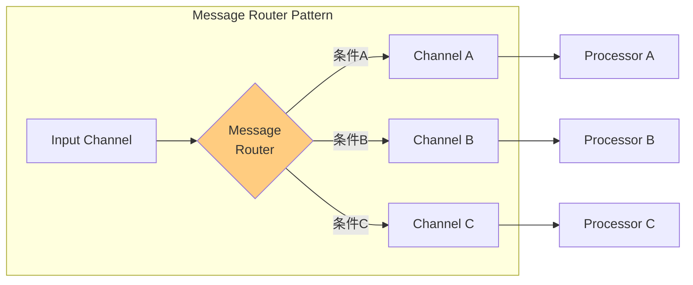
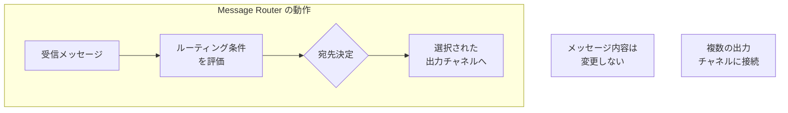

# Message Router

## 1. 3行要約 (Feynman Technique)
> **目的:** 専門用語を避け、直感的なメタファーを用いて「何をするものか」を定義する。
- 「交差点の交通整理員」のような役割。車（メッセージ）がどの道（チャネル）に進むべきか、条件に基づいて指示する
- メッセージの内容は変更せず、宛先の判定のみを担当する
- 核心的価値：**ルーティング決定ロジックの単一箇所への集約**

## 2. 解決する課題 (Context & Problem)
> **目的:** 「なぜこれが必要なのか？」という文脈（Pain Point）を明確にする。

- **Before:**
  - Pipes and Filtersチェーンで処理ステップが接続されている場合、条件に基づく分岐ができない
  - 各処理ステップが次の宛先を知っている必要がある（密結合）
  - ルーティングロジックが複数箇所に散在し、変更時の影響範囲が大きい

- **Trigger:**
  - 条件セットに基づいて異なるフィルターにメッセージを渡したい
  - 個々の処理ステップを疎結合にしたい
  - ルーティングルールを一箇所で管理したい

## 3. ソリューションと構造 (Structure & Visual)
> **目的:** Dual Coding（文字と図）により記憶定着を図る。

### 仕組み
Pipes and Filtersアーキテクチャに「特殊なフィルター」であるMessage Routerを挿入する。ルーターは：
- 1つのMessage Channelからメッセージを読み込む
- 条件セットに基づいて評価
- 適切なChannelにメッセージを再発行

### 構造図



### Message Routerの特性



## 4. トレードオフと制約 (Critical Thinking)

### Pros (利点):
- **疎結合**: 送信者・受信者がお互いを知らなくて良い
- **一元管理**: ルーティングルール変更時、ルーターのみ修正すれば良い
- **順序保証**: 全メッセージが単一ポイントを通過するため順序が保証される
- **可視性**: ルーティングロジックが一箇所に集約され把握しやすい

### Cons (欠点・副作用):
- **単一障害点**: ルーターがダウンするとメッセージフローが停止
- **ボトルネック**: 高負荷時にスループットの制約になる可能性
- **複雑性**: ルーティング条件が増えるとルーター自体が複雑化

### Anti-Pattern:
- ルーター内でビジネスロジックを実行する（責務の混在）
- 過度に複雑なルーティング条件（ルールエンジンの採用を検討すべき）
- 単一の巨大ルーターで全てのルーティングを処理（ボトルネック化）

## 5. 実装イメージ (Implementation)

### Akka Typed Actor (Scala)

```scala
import akka.actor.typed.{ActorRef, Behavior}
import akka.actor.typed.scaladsl.Behaviors

// メッセージ定義
sealed trait RouterMessage
case class RouteMessage(content: String, msgType: String) extends RouterMessage

// ルーティング先のプロセッサ
object ProcessorA {
  def apply(): Behavior[RouterMessage] =
    Behaviors.receive { (context, message) =>
      context.log.info(s"ProcessorA received: $message")
      Behaviors.same
    }
}

object ProcessorB {
  def apply(): Behavior[RouterMessage] =
    Behaviors.receive { (context, message) =>
      context.log.info(s"ProcessorB received: $message")
      Behaviors.same
    }
}

// Message Router
object MessageRouter {
  sealed trait Command
  case class Route(message: RouterMessage) extends Command
  case class RegisterRoute(
    condition: RouterMessage => Boolean,
    destination: ActorRef[RouterMessage]
  ) extends Command

  def apply(
    routes: Map[RouterMessage => Boolean, ActorRef[RouterMessage]],
    defaultRoute: ActorRef[RouterMessage]
  ): Behavior[Command] =
    Behaviors.receive { (context, command) =>
      command match {
        case Route(message) =>
          // 条件に一致する最初のルートにメッセージを送信
          val destination = routes.collectFirst {
            case (condition, dest) if condition(message) => dest
          }.getOrElse(defaultRoute)

          context.log.info(s"Routing message to: ${destination.path.name}")
          destination ! message
          Behaviors.same

        case RegisterRoute(condition, destination) =>
          // 新しいルートを追加
          apply(routes + (condition -> destination), defaultRoute)
      }
    }
}

// 使用例
object RouterExample extends App {
  val system = ActorSystem(
    Behaviors.setup[Nothing] { context =>
      val processorA = context.spawn(ProcessorA(), "processorA")
      val processorB = context.spawn(ProcessorB(), "processorB")
      val defaultProcessor = context.spawn(ProcessorA(), "default")

      val routes: Map[RouterMessage => Boolean, ActorRef[RouterMessage]] = Map(
        (msg => msg.msgType == "A") -> processorA,
        (msg => msg.msgType == "B") -> processorB
      )

      val router = context.spawn(
        MessageRouter(routes, defaultProcessor),
        "router"
      )

      router ! MessageRouter.Route(RouteMessage("Hello", "A"))
      router ! MessageRouter.Route(RouteMessage("World", "B"))

      Behaviors.empty
    },
    "RouterSystem"
  )
}
```

## 6. リンクと関係性 (Network Knowledge)

### 関連パターン:
- [[content_based_router|Content-Based Router]] (特化: メッセージ内容に基づくルーティング)
- [[message_filter|Message Filter]] (特化: 条件に合わないメッセージを破棄)
- [[dynamic_router|Dynamic Router]] (特化: 実行時にルール変更可能)
- [[recipient_list|Recipient List]] (比較: 複数宛先への送信)
- [[pipes_and_filters|Pipes and Filters]] - ルーターが動作するアーキテクチャ

### 構成要素:
- [[message_channel|Message Channel]] - 入力・出力のパイプ
- [[message|Message]] - ルーティング対象

### 次のステップ:
- [[content_based_router|Content-Based Router]] - 最も一般的なルーター実装
- [[dynamic_router|Dynamic Router]] - 動的ルーティングが必要な場合
