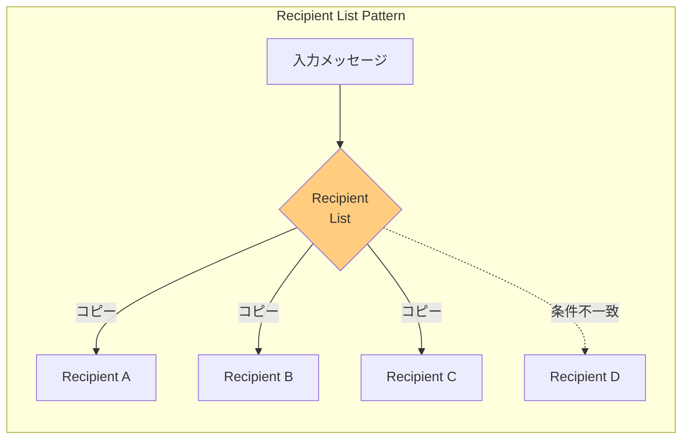
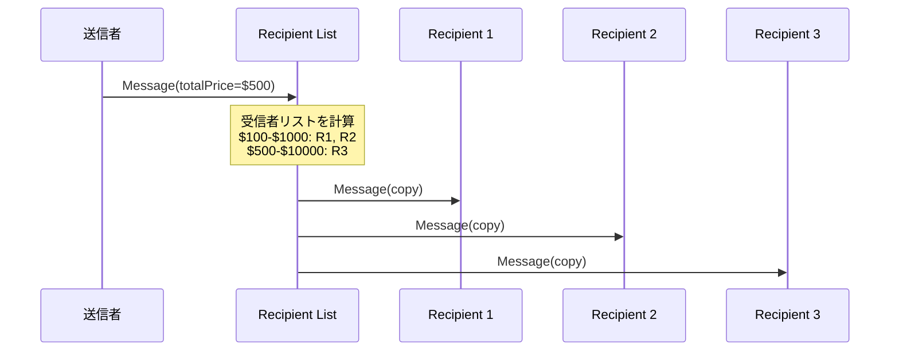

# Recipient List

## 1. 3行要約 (Feynman Technique)
> **目的:** 専門用語を避け、直感的なメタファーを用いて「何をするものか」を定義する。
- 「メーリングリスト」のような役割。1通のメールを書くと、リストに登録された全員にコピーが届く
- メッセージの内容を検査して、動的に受信者リストを計算し、全員にメッセージのコピーを送信
- 核心的価値：**1つのメッセージを複数の関連する受信者に配信**

## 2. 解決する課題 (Context & Problem)
> **目的:** 「なぜこれが必要なのか？」という文脈（Pain Point）を明確にする。

- **Before:**
  - 複数の受信者にメッセージを送信したいが、受信者が動的に決まる
  - 例：見積依頼を複数のサプライヤーに送りたいが、注文金額によって対象サプライヤーが異なる
  - 送信者が全ての受信者とその条件を管理するのは困難

- **Trigger:**
  - 動的に指定された受信者のリストにメッセージをルーティングしたい
  - 受信者リストをメッセージ内容に基づいて計算したい
  - 複数の受信者に同じメッセージ（のコピー）を送信したい

## 3. ソリューションと構造 (Structure & Visual)
> **目的:** Dual Coding（文字と図）により記憶定着を図る。

### 仕組み
各受信者に対してチャネルを定義し、Recipient Listを使用して：
1. 受信メッセージを検査
2. 目的の受信者リストを計算
3. すべての関連チャネルにメッセージのコピーを転送

メッセージ内容は通常、修正されない。

### 構造図



### 受信者リストの計算フロー



## 4. トレードオフと制約 (Critical Thinking)

### Pros (利点):
- **動的配信**: メッセージ内容に基づいて受信者を決定
- **疎結合**: 送信者は受信者を知らなくて良い
- **柔軟性**: 受信者の追加・削除が容易
- **効率性**: 必要な受信者にのみ配信

### Cons (欠点・副作用):
- **メッセージ増幅**: 受信者数に比例してメッセージ数が増加
- **結果集約の複雑さ**: 応答を集約する場合、Aggregatorが必要
- **一貫性**: 複数の受信者への配信の原子性が保証されない
- **受信者リスト計算コスト**: 複雑なルールの場合オーバーヘッドが発生

### Anti-Pattern:
- 受信者リストを静的にハードコード（変更時に再デプロイが必要）
- 全ての受信者に無条件で送信（Publish-Subscribe Channelを使うべき）
- 応答の集約を考慮せずに使用

## 5. 実装イメージ (Implementation)

### Akka Typed Actor (Scala)

```scala
import akka.actor.typed.{ActorRef, Behavior}
import akka.actor.typed.scaladsl.Behaviors

// ドメインモデル
case class RequestForQuotation(
  rfqId: String,
  retailItems: Seq[RetailItem]
) {
  val totalRetailPrice: Double = retailItems.map(_.retailPrice).sum
}

case class RetailItem(itemId: String, retailPrice: Double)

// 見積リクエスト
case class RequestPriceQuote(
  rfqId: String,
  itemId: String,
  retailPrice: Double,
  orderTotalRetailPrice: Double
)

// 受信者の興味範囲
case class PriceQuoteInterest(
  quoterId: String,
  quoteProcessor: ActorRef[RequestPriceQuote],
  lowTotalRetail: Double,
  highTotalRetail: Double
)

// Recipient List
object RecipientList {
  sealed trait Command
  case class ProcessRfq(rfq: RequestForQuotation) extends Command
  case class RegisterInterest(interest: PriceQuoteInterest) extends Command

  def apply(): Behavior[Command] = router(Vector.empty)

  private def router(
    interests: Vector[PriceQuoteInterest]
  ): Behavior[Command] =
    Behaviors.receive { (context, command) =>
      command match {
        case RegisterInterest(interest) =>
          context.log.info(s"Registered: ${interest.quoterId}")
          router(interests :+ interest)

        case ProcessRfq(rfq) =>
          // 受信者リストを動的に計算
          val recipients = calculateRecipientList(rfq, interests)
          context.log.info(
            s"RFQ ${rfq.rfqId} dispatched to ${recipients.size} recipients"
          )

          // 各受信者にメッセージのコピーを送信
          recipients.foreach { interest =>
            rfq.retailItems.foreach { item =>
              interest.quoteProcessor ! RequestPriceQuote(
                rfq.rfqId,
                item.itemId,
                item.retailPrice,
                rfq.totalRetailPrice
              )
            }
          }
          Behaviors.same
      }
    }

  private def calculateRecipientList(
    rfq: RequestForQuotation,
    interests: Vector[PriceQuoteInterest]
  ): Vector[PriceQuoteInterest] = {
    val dominated = rfq.totalRetailPrice
    interests.filter { interest =>
      dominated >= interest.lowTotalRetail &&
      dominated <= interest.highTotalRetail
    }
  }
}

// 見積エンジン
object PriceQuoteProcessor {
  def apply(quoterId: String, discountRate: Double): Behavior[RequestPriceQuote] =
    Behaviors.receive { (context, request) =>
      val discountPrice = request.retailPrice * (1 - discountRate)
      context.log.info(
        s"$quoterId: ${request.itemId} -> $discountPrice"
      )
      Behaviors.same
    }
}

// 使用例
object RecipientListExample {
  def apply(): Behavior[Nothing] =
    Behaviors.setup[Nothing] { context =>
      val recipientList = context.spawn(RecipientList(), "recipientList")

      // 見積エンジンを登録
      val budgetHikers = context.spawn(
        PriceQuoteProcessor("BudgetHikers", 0.05),
        "budgetHikers"
      )
      recipientList ! RecipientList.RegisterInterest(
        PriceQuoteInterest("BudgetHikers", budgetHikers, 1.0, 1000.0)
      )

      val highSierra = context.spawn(
        PriceQuoteProcessor("HighSierra", 0.03),
        "highSierra"
      )
      recipientList ! RecipientList.RegisterInterest(
        PriceQuoteInterest("HighSierra", highSierra, 100.0, 10000.0)
      )

      // 見積依頼を送信
      recipientList ! RecipientList.ProcessRfq(
        RequestForQuotation("RFQ-001", Seq(
          RetailItem("item1", 29.95),
          RetailItem("item2", 99.95)
        ))
      )

      Behaviors.empty
    }
}
```

## 6. リンクと関係性 (Network Knowledge)

### 関連パターン:
- [[aggregator|Aggregator]] - 複数の応答を集約（Scatter-Gatherで組み合わせ）
- [[scatter_gather|Scatter-Gather]] (組み合わせ: Recipient List + Aggregator)
- [[content_based_router|Content-Based Router]] (比較: 単一宛先 vs 複数宛先)
- [[dynamic_router|Dynamic Router]] (比較: 動的ルール更新の仕組み)
- [[message_filter|Message Filter]] (比較: 通過/破棄 vs 複数宛先)

### 構成要素:
- [[message_channel|Message Channel]] - 各受信者へのチャネル
- [[correlation_identifier|Correlation Identifier]] - 応答の関連付け

### 次のステップ:
- [[aggregator|Aggregator]] - 応答の集約が必要な場合
- [[scatter_gather|Scatter-Gather]] - 問い合わせ→応答集約のパターン
