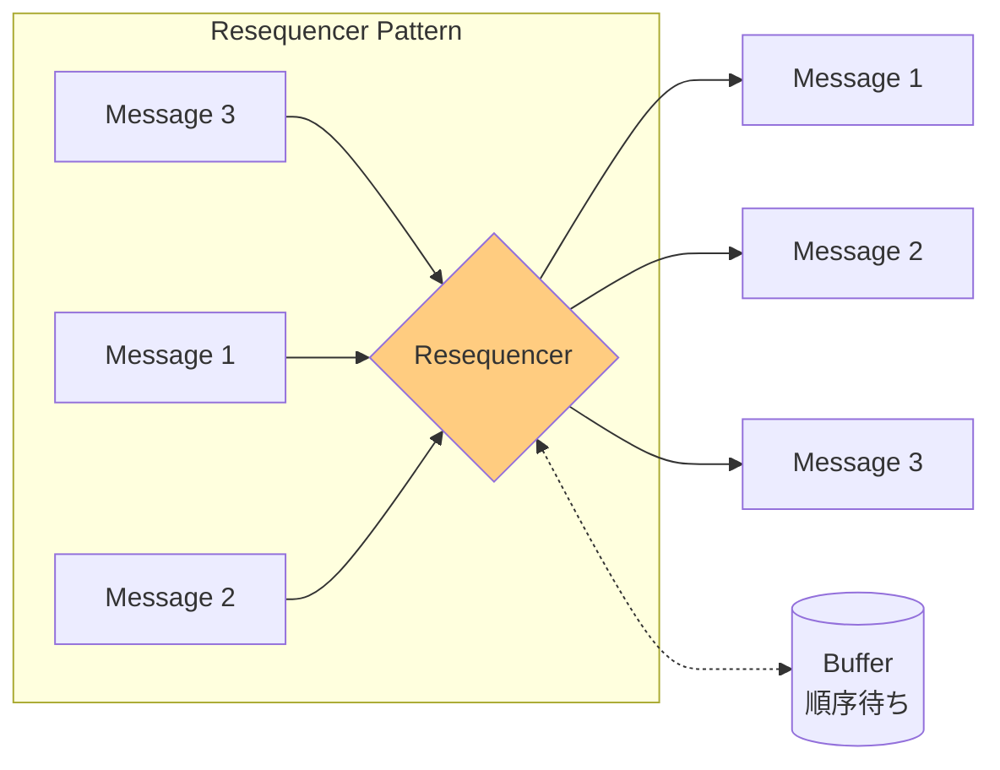
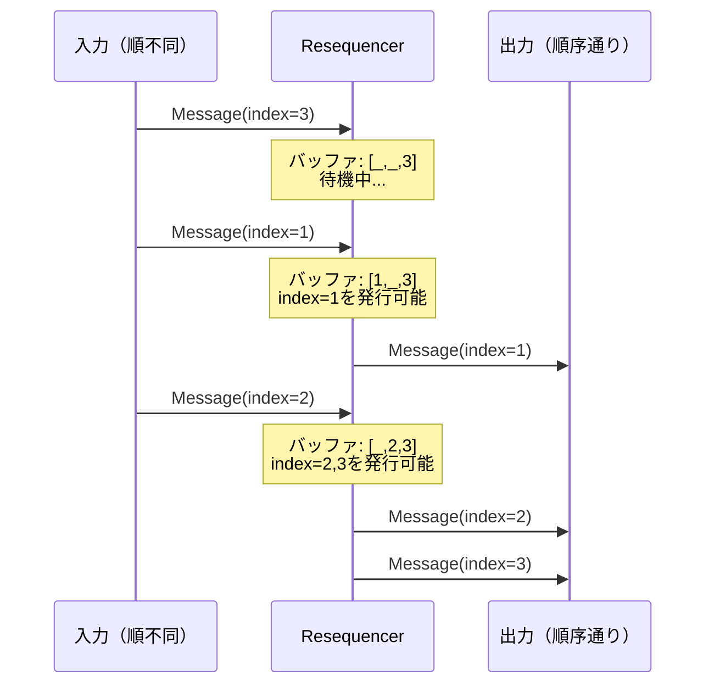

# Resequencer

## 1. 3行要約 (Feynman Technique)
> **目的:** 専門用語を避け、直感的なメタファーを用いて「何をするものか」を定義する。
- 「バラバラに届いた本を巻数順に並べ直す図書館員」のような役割
- 順序が乱れて到着したメッセージを、元のシーケンス順に並べ替えて出力
- 核心的価値：**メッセージ順序の復元**

## 2. 解決する課題 (Context & Problem)
> **目的:** 「なぜこれが必要なのか？」という文脈（Pain Point）を明確にする。

- **Before:**
  - Splitterで分割されたメッセージが、異なるルートで処理され順序が乱れる
  - 例：メッセージ1,2,3を送信したが、処理時間の違いで3,1,2の順で到着
  - 参照整合性など、順序保証が必要な処理ステップが存在

- **Trigger:**
  - 順不同で到着するメッセージを、元の順序に戻したい
  - 下流のシステムがメッセージの順序に依存している
  - 複数の送信元からのメッセージをマージする際に順序を保証したい

## 3. ソリューションと構造 (Structure & Visual)
> **目的:** Dual Coding（文字と図）により記憶定着を図る。

### 仕組み
ステートフルなフィルターであるResequencerを使用して、順不同で到着するメッセージを収集・再順序化し、指定された順序で出力チャネルに発行する。

- 順不同で到着するメッセージストリームを受け取る
- 内部バッファに順序外のメッセージを保持
- 完全なシーケンスが得られるまで待機
- 順序通りのメッセージを出力チャネルに発行
- メッセージ内容は通常変更しない

### 構造図



### 処理フロー



## 4. トレードオフと制約 (Critical Thinking)

### Pros (利点):
- **順序保証**: 下流システムに順序通りのメッセージを保証
- **透明性**: 上流・下流の変更なしに順序問題を解決
- **柔軟性**: 任意のシーケンス番号方式に対応可能

### Cons (欠点・副作用):
- **ステートフル**: バッファにメッセージを保持するためメモリ使用量増加
- **レイテンシ**: 先行メッセージが到着するまで後続メッセージを保持
- **タイムアウト管理**: メッセージが欠落した場合の処理が必要
- **出力チャネル要件**: 出力チャネルも順序保証が必要

### メッセージ配信の基本保証（Akka）

| 事実 | 説明 |
|-----|------|
| 同一送信元からの順序 | A1→A2への直接送信では、M1,M2,M3は順序通り到着 |
| 複数送信元の場合 | A1,A3→A2への送信では、インターリーブの可能性あり |
| 配信保証なし | デフォルトではメッセージがドロップする可能性あり |

### Anti-Pattern:
- タイムアウトを設定しない（永久にバッファに溜まる可能性）
- シーケンス番号を付与せずにResequencerを使用
- 単一送信元からの直接送信に対してResequencerを使用（不要）

## 5. 実装イメージ (Implementation)

### Akka Typed Actor (Scala)

```scala
import akka.actor.typed.{ActorRef, Behavior}
import akka.actor.typed.scaladsl.{Behaviors, TimerScheduler}
import scala.collection.immutable.TreeMap
import scala.concurrent.duration._

// シーケンス付きメッセージ
case class SequencedMessage[T](
  correlationId: String,
  sequenceNumber: Int,
  totalCount: Option[Int],  // 総数が分かっている場合
  payload: T
)

// Resequencer
object Resequencer {
  sealed trait Command[+T]
  case class Receive[T](message: SequencedMessage[T]) extends Command[T]
  private case class Timeout[T](correlationId: String) extends Command[T]

  case class SequenceState[T](
    nextExpected: Int,
    buffer: TreeMap[Int, SequencedMessage[T]],
    totalCount: Option[Int]
  )

  def apply[T](
    output: ActorRef[T],
    timeout: FiniteDuration = 5.seconds
  ): Behavior[Command[T]] =
    Behaviors.withTimers { timers =>
      resequencer(Map.empty, output, timers, timeout)
    }

  private def resequencer[T](
    sequences: Map[String, SequenceState[T]],
    output: ActorRef[T],
    timers: TimerScheduler[Command[T]],
    timeout: FiniteDuration
  ): Behavior[Command[T]] =
    Behaviors.receive { (context, command) =>
      command match {
        case Receive(message) =>
          val correlationId = message.correlationId
          val state = sequences.getOrElse(
            correlationId,
            SequenceState[T](1, TreeMap.empty, message.totalCount)
          )

          // タイマーを設定/リセット
          timers.startSingleTimer(
            correlationId,
            Timeout(correlationId),
            timeout
          )

          // バッファに追加
          val newBuffer = state.buffer + (message.sequenceNumber -> message)
          val newState = state.copy(
            buffer = newBuffer,
            totalCount = state.totalCount.orElse(message.totalCount)
          )

          // 順序通りに出力可能なメッセージを発行
          val (dispatchedState, dispatched) = dispatchInOrder(newState, output, context)

          if (dispatched > 0) {
            context.log.info(s"Dispatched $dispatched messages for $correlationId")
          }

          // 完了チェック
          val isComplete = dispatchedState.totalCount.exists { total =>
            dispatchedState.nextExpected > total
          }

          if (isComplete) {
            timers.cancel(correlationId)
            context.log.info(s"Sequence $correlationId complete")
            resequencer(sequences - correlationId, output, timers, timeout)
          } else {
            resequencer(
              sequences + (correlationId -> dispatchedState),
              output, timers, timeout
            )
          }

        case Timeout(correlationId) =>
          sequences.get(correlationId).foreach { state =>
            context.log.warn(
              s"Timeout for $correlationId, " +
              s"buffer size: ${state.buffer.size}, " +
              s"next expected: ${state.nextExpected}"
            )
            // タイムアウト時は残りのバッファを順序通りに出力
            state.buffer.values.toSeq
              .sortBy(_.sequenceNumber)
              .foreach(msg => output ! msg.payload)
          }
          resequencer(sequences - correlationId, output, timers, timeout)
      }
    }

  private def dispatchInOrder[T](
    state: SequenceState[T],
    output: ActorRef[T],
    context: akka.actor.typed.scaladsl.ActorContext[Command[T]]
  ): (SequenceState[T], Int) = {
    var current = state
    var dispatched = 0

    while (current.buffer.contains(current.nextExpected)) {
      val message = current.buffer(current.nextExpected)
      output ! message.payload
      context.log.debug(
        s"Dispatched seq ${message.sequenceNumber} for ${message.correlationId}"
      )

      current = current.copy(
        nextExpected = current.nextExpected + 1,
        buffer = current.buffer - current.nextExpected
      )
      dispatched += 1
    }

    (current, dispatched)
  }
}

// 使用例
object ResequencerExample {
  case class OrderItem(id: String, name: String)

  def apply(): Behavior[Nothing] =
    Behaviors.setup[Nothing] { context =>
      val outputProcessor = context.spawn(
        Behaviors.receiveMessage[OrderItem] { item =>
          println(s"Processing in order: ${item.id}")
          Behaviors.same
        },
        "outputProcessor"
      )

      val resequencer = context.spawn(
        Resequencer[OrderItem](outputProcessor),
        "resequencer"
      )

      // 順不同で到着するメッセージをシミュレート
      resequencer ! Resequencer.Receive(
        SequencedMessage("order-1", 3, Some(3), OrderItem("item3", "C"))
      )
      resequencer ! Resequencer.Receive(
        SequencedMessage("order-1", 1, Some(3), OrderItem("item1", "A"))
      )
      resequencer ! Resequencer.Receive(
        SequencedMessage("order-1", 2, Some(3), OrderItem("item2", "B"))
      )
      // 出力: item1 -> item2 -> item3 (順序通り)

      Behaviors.empty
    }
}
```

## 6. リンクと関係性 (Network Knowledge)

### 関連パターン:
- [[splitter|Splitter]] (原因: 分割により順序が乱れる)
- [[aggregator|Aggregator]] (比較: 集約 vs 順序復元)
- [[content_based_router|Content-Based Router]] (原因: ルーティングにより順序が乱れる)
- [[message_sequence|Message Sequence]] - シーケンス情報の付与
- [[correlation_identifier|Correlation Identifier]] - メッセージの関連付け

### 構成要素:
- [[message_channel|Message Channel]] - 入出力チャネル
- [[message_store|Message Store]] - バッファの永続化

### 次のステップ:
- [[aggregator|Aggregator]] - 順序復元後に集約が必要な場合
- [[composed_message_processor|Composed Message Processor]] - 分割→処理→順序復元→集約の完全なパターン
