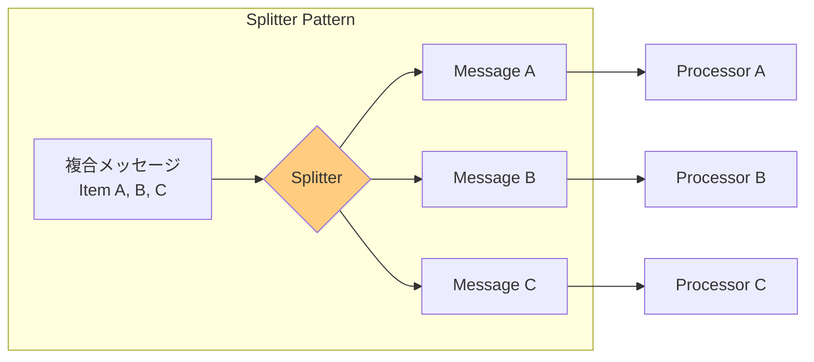
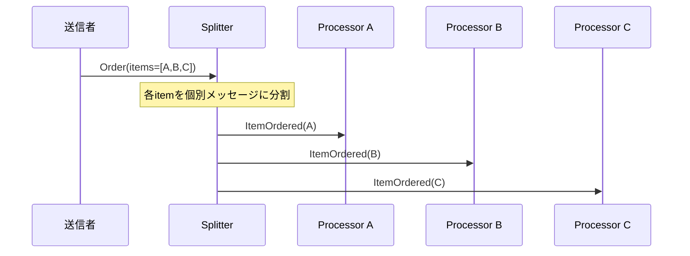

# Splitter

## 1. 3行要約 (Feynman Technique)
> **目的:** 専門用語を避け、直感的なメタファーを用いて「何をするものか」を定義する。
- 「宅配便の仕分け」のような役割。複数の荷物が入った大きな箱を開けて、個別の荷物に分けて配送先ごとに振り分ける
- 複合メッセージ（例：複数の注文アイテムを含む注文）を個別のメッセージに分割
- 核心的価値：**複合メッセージの要素ごとの個別処理を可能にする**

## 2. 解決する課題 (Context & Problem)
> **目的:** 「なぜこれが必要なのか？」という文脈（Pain Point）を明確にする。

- **Before:**
  - 複合メッセージ（例：複数の行項目を含む顧客注文）を処理する必要がある
  - 各要素が異なる方法で処理される必要がある
  - 例：注文内の商品タイプによって、異なる在庫システムで検証が必要

- **Trigger:**
  - 複数要素を含むメッセージを処理する際、各要素を個別に扱いたい
  - 各要素を並列処理したい
  - 各要素を異なるシステムに送信したい

## 3. ソリューションと構造 (Structure & Visual)
> **目的:** Dual Coding（文字と図）により記憶定着を図る。

### 仕組み
Splitterを使用して複合メッセージを個別メッセージの系列に分割する。
- 元のメッセージから各要素ごとに個別のメッセージを発行
- 各メッセージは適切な処理先にルーティング可能

### 構造図



### 処理フロー



## 4. トレードオフと制約 (Critical Thinking)

### Pros (利点):
- **並列処理**: 各要素を独立して並列処理可能
- **柔軟なルーティング**: 各要素を異なるシステムに送信可能
- **スケーラビリティ**: 要素ごとに処理をスケール可能
- **責務分離**: 各プロセッサは特定の要素タイプのみ処理

### Cons (欠点・副作用):
- **メッセージ増幅**: 1つのメッセージがN個に増加
- **順序喪失**: 分割後の処理順序が保証されない
- **集約の必要性**: 結果を統合する場合、Aggregatorが必要
- **トランザクション境界**: 元のメッセージの原子性が失われる

### Anti-Pattern:
- 分割後の結果集約を考慮しない
- 元のメッセージとの相関識別子（Correlation ID）を付与しない
- 単一要素のメッセージに対してSplitterを使用

## 5. 実装イメージ (Implementation)

### Akka Typed Actor (Scala)

```scala
import akka.actor.typed.{ActorRef, Behavior}
import akka.actor.typed.scaladsl.Behaviors

// ドメインモデル
case class Order(orderId: String, items: Seq[OrderItem])
case class OrderItem(itemId: String, itemType: String, quantity: Int)

// 分割後のメッセージ（Correlation ID付き）
case class SplitOrderItem(
  correlationId: String,  // 元のorderIdを保持
  sequenceNumber: Int,    // 分割されたメッセージの順序
  totalItems: Int,        // 分割総数
  item: OrderItem
)

// Splitter
object OrderSplitter {
  sealed trait Command
  case class Split(order: Order) extends Command

  def apply(
    itemProcessor: ActorRef[SplitOrderItem]
  ): Behavior[Command] =
    Behaviors.receive { (context, command) =>
      command match {
        case Split(order) =>
          context.log.info(s"Splitting order ${order.orderId} into ${order.items.size} items")

          // 各アイテムを個別メッセージとして発行
          order.items.zipWithIndex.foreach { case (item, index) =>
            val splitItem = SplitOrderItem(
              correlationId = order.orderId,
              sequenceNumber = index + 1,
              totalItems = order.items.size,
              item = item
            )
            context.log.info(s"Split item: ${item.itemId}")
            itemProcessor ! splitItem
          }
          Behaviors.same
      }
    }
}

// Content-Based Router と組み合わせた Splitter
object SplitterWithRouter {
  sealed trait Command
  case class Split(order: Order) extends Command

  def apply(
    typeAProcessor: ActorRef[SplitOrderItem],
    typeBProcessor: ActorRef[SplitOrderItem],
    defaultProcessor: ActorRef[SplitOrderItem]
  ): Behavior[Command] =
    Behaviors.receive { (context, command) =>
      command match {
        case Split(order) =>
          order.items.zipWithIndex.foreach { case (item, index) =>
            val splitItem = SplitOrderItem(
              correlationId = order.orderId,
              sequenceNumber = index + 1,
              totalItems = order.items.size,
              item = item
            )

            // 分割後に Content-Based Routing
            val destination = item.itemType match {
              case "TypeA" => typeAProcessor
              case "TypeB" => typeBProcessor
              case _       => defaultProcessor
            }

            context.log.info(
              s"Routing ${item.itemId} (${item.itemType}) to ${destination.path.name}"
            )
            destination ! splitItem
          }
          Behaviors.same
      }
    }
}

// アイテムプロセッサ
object ItemProcessor {
  def apply(name: String): Behavior[SplitOrderItem] =
    Behaviors.receive { (context, splitItem) =>
      context.log.info(
        s"$name processing: ${splitItem.item.itemId} " +
        s"(${splitItem.sequenceNumber}/${splitItem.totalItems})"
      )
      Behaviors.same
    }
}

// 使用例
object SplitterExample {
  def apply(): Behavior[Nothing] =
    Behaviors.setup[Nothing] { context =>
      val typeAProcessor = context.spawn(ItemProcessor("TypeA"), "typeAProcessor")
      val typeBProcessor = context.spawn(ItemProcessor("TypeB"), "typeBProcessor")
      val defaultProcessor = context.spawn(ItemProcessor("Default"), "defaultProcessor")

      val splitter = context.spawn(
        SplitterWithRouter(typeAProcessor, typeBProcessor, defaultProcessor),
        "splitter"
      )

      splitter ! SplitterWithRouter.Split(Order(
        "ORD-001",
        Seq(
          OrderItem("item1", "TypeA", 2),
          OrderItem("item2", "TypeB", 1),
          OrderItem("item3", "TypeA", 3)
        )
      ))

      Behaviors.empty
    }
}
```

## 6. リンクと関係性 (Network Knowledge)

### 関連パターン:
- [[aggregator|Aggregator]] (補完: 分割された結果を再統合)
- [[content_based_router|Content-Based Router]] (組み合わせ: 分割後のルーティング)
- [[composed_message_processor|Composed Message Processor]] (組み合わせ: Splitter + Router + Aggregator)
- [[resequencer|Resequencer]] (補完: 分割後の順序復元)
- [[correlation_identifier|Correlation Identifier]] - 分割メッセージの関連付け

### 構成要素:
- [[message_channel|Message Channel]] - 出力チャネル
- [[message|Message]] - 分割後の個別メッセージ

### 次のステップ:
- [[aggregator|Aggregator]] - 分割後の結果を集約する場合
- [[composed_message_processor|Composed Message Processor]] - 分割→処理→集約の完全なパターン
